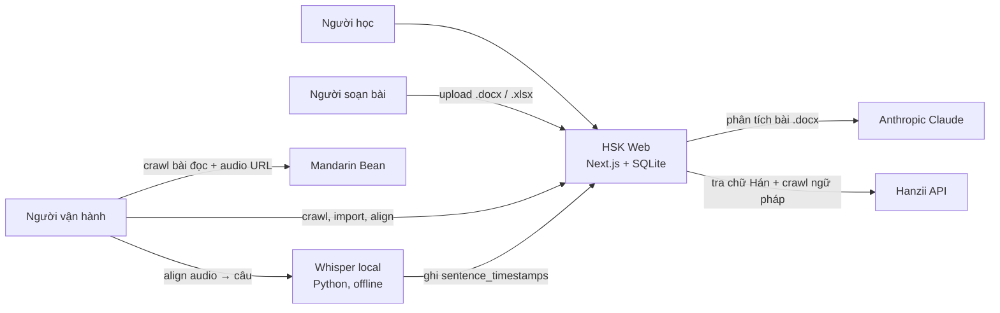
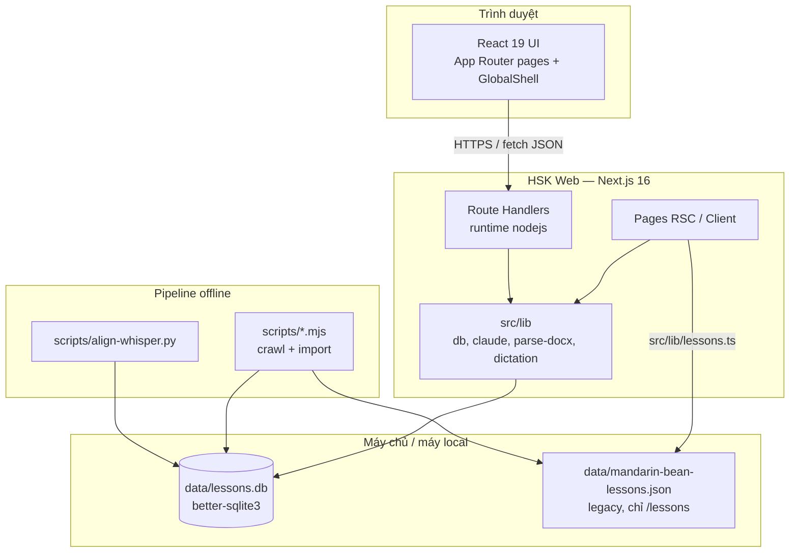
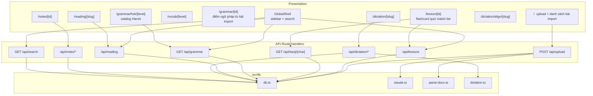
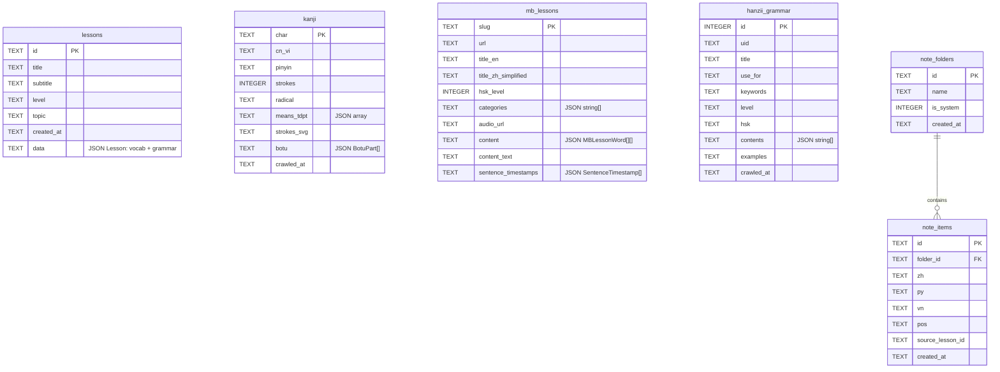
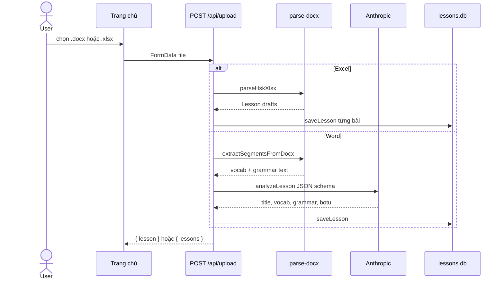
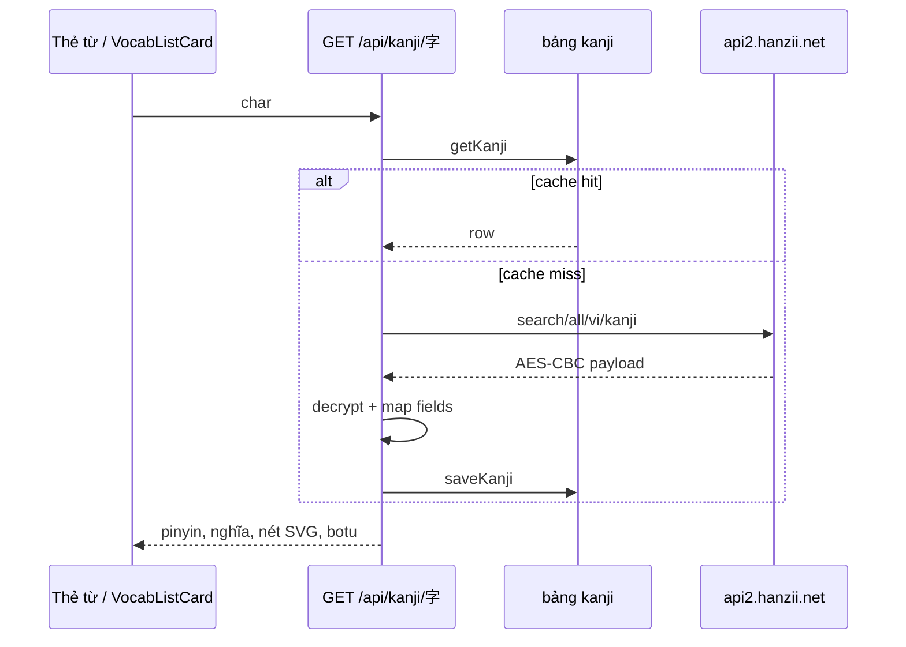
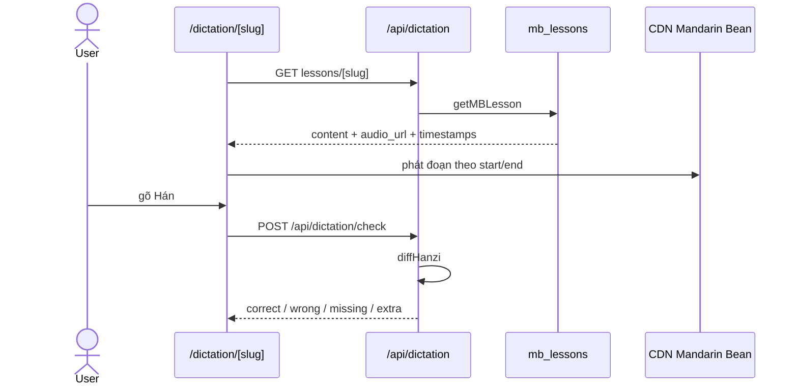
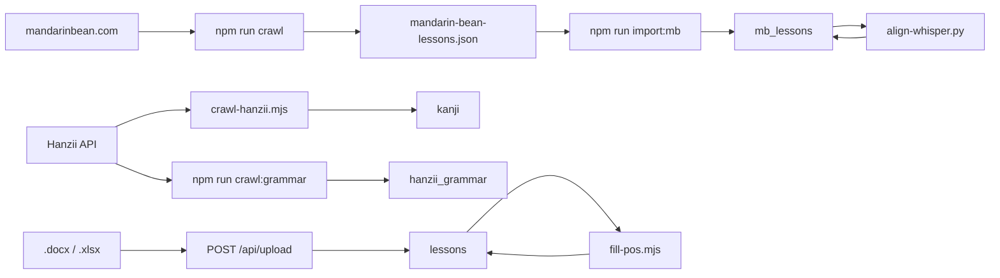
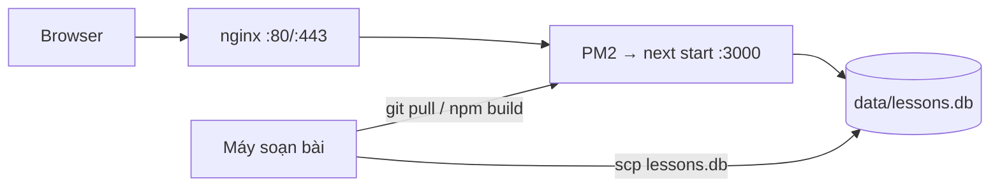

# Kiến trúc hệ thống — HSK Web

App học tiếng Trung (HSK) cho người Việt: **ice-bear is learning**. Đây là *modular monolith* Next.js, một process, một file SQLite. Không có microservice, queue, hay cache phân tán.

Tài liệu này khớp với code tại thời điểm viết. Khi thêm module mới, cập nhật các sơ đồ dưới đây.

## 1. Bối cảnh hệ thống

Người học dùng trình duyệt. App tự chứa UI, API và database. Bên ngoài chỉ có nguồn nội dung và AI; chúng không nằm trong runtime production trừ khi người dùng upload `.docx` hoặc tra chữ chưa có trong cache.



| Tác nhân | Việc làm |
|---|---|
| Người học | Flashcard, quiz, ghép thẻ, đọc bài, nghe/chép chính tả, ngữ pháp Hanzii, ghi chú |
| Người soạn bài | Upload `.docx` (Claude tách từ/ngữ pháp) hoặc `.xlsx` (parse trực tiếp) |
| Người vận hành | Crawl Mandarin Bean / Hanzii, import JSON, chạy Whisper align, `scp` file DB lên VPS |

## 2. Containers

Một container ứng dụng, một file dữ liệu, vài pipeline chạy tay.



| Container | Công nghệ | Vai trò |
|---|---|---|
| Web app | Next.js 16, React 19, Tailwind 4 | UI + API trong cùng process |
| SQLite | `better-sqlite3`, file `data/lessons.db` | Nguồn sự thật cho hầu hết dữ liệu |
| JSON Mandarin Bean | `data/mandarin-bean-lessons.json` | Bản crawl thô; route `/lessons` vẫn đọc file này |
| Pipeline Node | cheerio, better-sqlite3 | Crawl / import / điền từ loại |
| Pipeline Python | faster-whisper (venv) | Align audio bài đọc với từng câu Hán |

**Lưu ý kiến trúc:** `/reading` và `/dictation` đọc SQLite (`mb_lessons`). `/lessons` vẫn đọc JSON qua `src/lib/lessons.ts`. Hai đường này chưa gộp.

## 3. Modules trong app Next.js



`src/lib/db.ts` là lớp truy cập dữ liệu duy nhất cho SQLite: tạo bảng lazy, JSON blob trong một số cột, FTS-less search bằng quét `lessons.data`.

## 4. Mô hình dữ liệu

SQLite một file. Một số bảng lưu JSON text thay vì quan hệ đầy đủ.



| Bảng | Nguồn | Dùng cho |
|---|---|---|
| `lessons` | Upload `.docx`/`.xlsx` | Flashcard, quiz, ghép thẻ, `/grammar/[id]`, search |
| `kanji` | Hanzii on-demand + `crawl-hanzii.mjs` | Tra chữ, nét, bộ thủ trên thẻ từ |
| `mb_lessons` | Crawl Mandarin Bean + import | Đọc bài, luyện nghe, align timestamp |
| `hanzii_grammar` | `crawl-hanzii-grammar.mjs` | Catalog ngữ pháp theo HSK |
| `note_folders` / `note_items` | UI ghi chú | Folder + từ đã lưu; folder hệ thống `mistake` |

## 5. Luồng chính

### 5.1 Import bài học



### 5.2 Tra chữ Hán (cache-aside)



### 5.3 Luyện nghe / chép chính tả



Timestamp câu không sinh lúc runtime. Chúng đến từ `scripts/align-whisper.py` (offline), ghi vào `mb_lessons.sentence_timestamps`. UI `/dictation/align` cho phép rà và sửa tay.

### 5.4 Pipeline nội dung offline



## 6. Bản đồ route

### Pages

| Route | Dữ liệu | Ghi chú |
|---|---|---|
| `/` | `lessons` | Upload + thẻ bài import |
| `/lesson/[id]` | `lessons` | `?mode=` flashcard / quiz / match / list |
| `/vocab/[level]` | `lessons` (flat vocab theo HSK) | |
| `/grammar/[id]` | `lessons.grammar` | Điểm ngữ pháp trong bài import |
| `/grammar/hsk/[level]` | `hanzii_grammar` | Catalog theo HSK |
| `/reading`, `/reading/[slug]` | `mb_lessons` | Đọc có pinyin/định nghĩa |
| `/lessons`, `/lessons/[slug]` | JSON file | Catalog Mandarin Bean kiểu cũ |
| `/dictation`, `/dictation/[slug]` | `mb_lessons` | Nghe + chép |
| `/dictation/align`, `/dictation/align/[slug]` | `mb_lessons` timestamps | Công cụ vận hành |
| `/notes`, `/notes/[id]` | `note_folders` / `note_items` | |

### API

| Method | Path | Việc |
|---|---|---|
| POST | `/api/upload` | Parse + lưu bài import |
| GET/DELETE | `/api/lessons`, `/api/lessons/[id]` | CRUD metadata / xóa bài |
| GET | `/api/vocab?level=` | Vocab theo HSK |
| GET | `/api/search?q=` | Tìm từ trong JSON `lessons.data` |
| GET | `/api/grammar?level=` | Catalog Hanzii; không `level` thì trả counts |
| GET | `/api/kanji/[char]` | Cache-aside Hanzii |
| GET | `/api/reading`, `/api/reading/[slug]` | Bài đọc SQLite |
| GET | `/api/dictation/lessons`, `.../[slug]` | List/detail luyện nghe |
| POST | `/api/dictation/check` | So chữ với câu gốc |
| GET | `/api/dictation/align`, `.../[slug]` | Tóm tắt / chi tiết align |
| GET/POST/PATCH/DELETE | `/api/notes/folders`, `/api/notes/items` | Ghi chú |

Hầu hết handler khai `runtime = 'nodejs'` vì `better-sqlite3` là native addon — không chạy trên Edge.

## 7. Deploy

Local và VPS cùng mô hình: Node process + file SQLite cạnh repo. Không fit serverless (Vercel) nếu vẫn dùng `better-sqlite3`.



Chi tiết từng lệnh: `DEPLOY_SQLITE_VPS.md` (file local, không commit). Tóm tắt:

1. Clone repo trên VPS, `npm install && npm run build`
2. Copy `data/lessons.db` bằng `scp` (file bị gitignore)
3. `pm2 start npm --name hsk-web -- start`
4. Nginx reverse proxy vào `localhost:3000`

Cập nhật nội dung bài đọc/align: chạy pipeline trên máy local, rồi `scp` lại DB. Không cần rebuild nếu chỉ đổi data.

## 8. Ranh giới và nợ kỹ thuật

- **Hai nguồn bài đọc:** JSON (`src/lib/lessons.ts` → `/lessons`) và SQLite (`mb_lessons` → `/reading`, `/dictation`). Nên gom về SQLite.
- **Search quét full table:** `searchVocab` parse JSON từng hàng `lessons`. Ổn với quy mô hiện tại, không scale.
- **JSON blob:** `lessons.data`, `mb_lessons.content` khó query/index từng từ.
- **Không auth:** mọi API đều public trên VPS.
- **Hanzii decrypt key** nằm trong source (`kanji` route + crawl scripts) — phụ thuộc API bên thứ ba, có thể gãy bất kỳ lúc nào.
- **Claude chỉ lúc import `.docx`:** runtime học không gọi AI.

## 9. Cây thư mục liên quan

```text
src/app/            pages + api route handlers + GlobalShell
src/lib/            db, claude, parse-docx, dictation, lessons (JSON)
src/types/          Lesson, Grammar, HanziiGrammar, …
data/lessons.db     SQLite (gitignore)
scripts/            crawl, import, fill-pos, align-whisper.py
DEPLOY_SQLITE_VPS.md  hướng dẫn VPS (local only)
```
