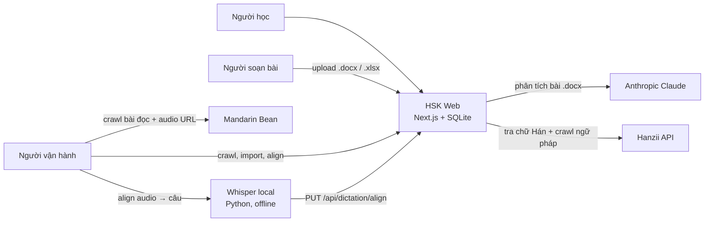
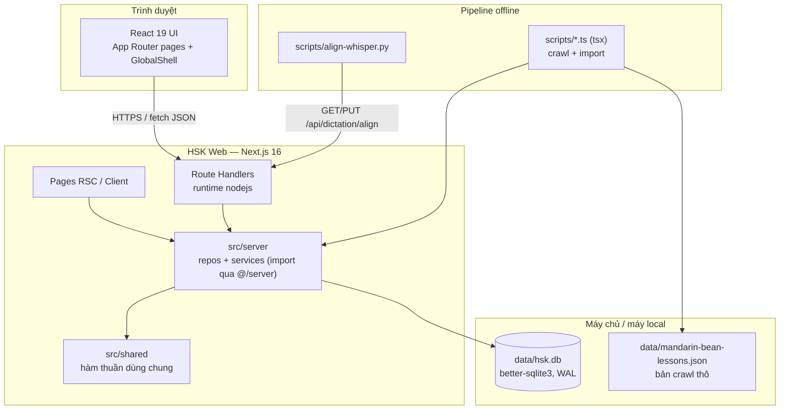
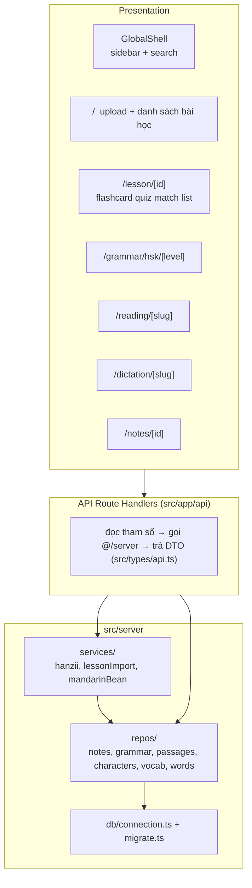
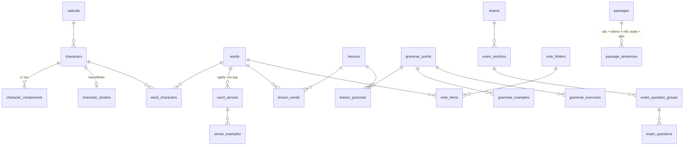
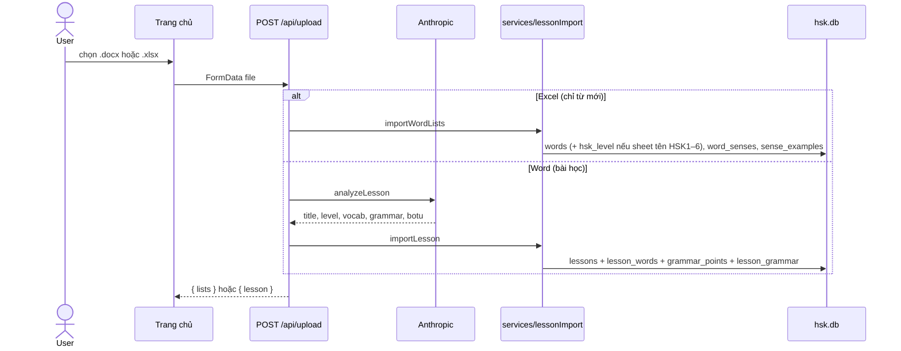
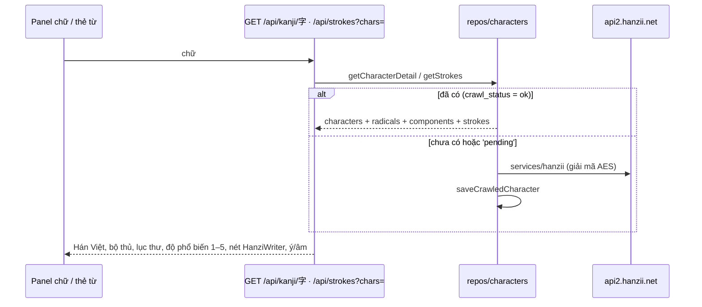
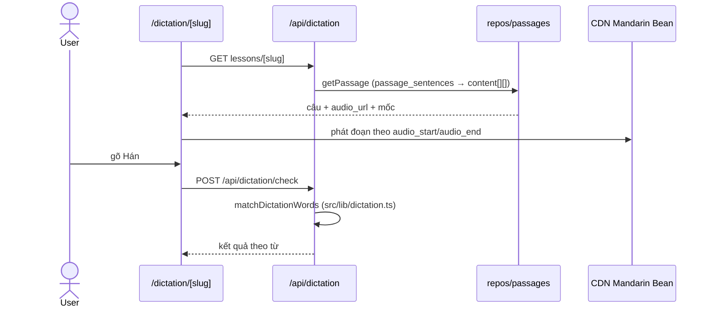
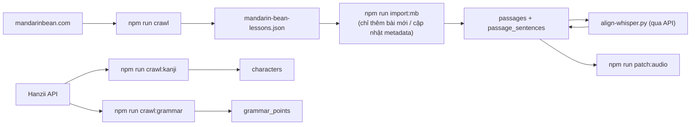
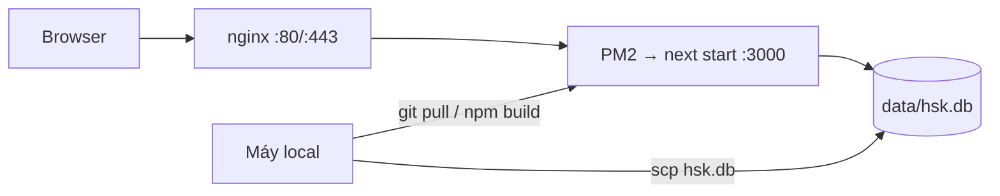

# Kiến trúc hệ thống — HSK Web

App học tiếng Trung (HSK) cho người Việt: **ice-bear is learning**. Đây là *modular monolith* Next.js, một process, một file SQLite. Không có microservice, queue, hay cache phân tán.

Tài liệu này khớp với code tại thời điểm viết. Khi thêm module mới, cập nhật các sơ đồ dưới đây.

## 1. Bối cảnh hệ thống

Người học dùng trình duyệt. App tự chứa UI, API và database. Bên ngoài chỉ có nguồn nội dung và AI; chúng không nằm trong runtime production trừ khi người dùng upload `.docx` hoặc tra chữ chưa có trong cache.


```mermaid
flowchart LR
  learner["Người học"]
  teacher["Người soạn bài"]
  ops["Người vận hành"]
  app["HSK Web\nNext.js + SQLite"]
  claude["Anthropic Claude"]
  hanzii["Hanzii API"]
  mb["Mandarin Bean"]
  whisper["Whisper local\nPython, offline"]

  learner --> app
  teacher -->|"upload .docx / .xlsx"| app
  ops -->|"crawl, import, align"| app
  app -->|"phân tích bài .docx"| claude
  app -->|"tra chữ Hán + crawl ngữ pháp"| hanzii
  ops -->|"crawl bài đọc + audio URL"| mb
  ops -->|"align audio → câu"| whisper
  whisper -->|"PUT /api/dictation/align"| app
```

| Tác nhân | Việc làm |
|---|---|
| Người học | Flashcard, quiz, ghép thẻ, đọc bài, nghe/chép chính tả, ngữ pháp Hanzii, ghi chú |
| Người soạn bài | Upload `.docx` (Claude tách từ/ngữ pháp) hoặc `.xlsx` (parse trực tiếp) |
| Người vận hành | Crawl Mandarin Bean / Hanzii, import JSON, chạy Whisper align, `scp` file DB lên VPS |

## 2. Containers

Một container ứng dụng, một file dữ liệu, vài pipeline chạy tay.


```mermaid
flowchart TB
  subgraph client ["Trình duyệt"]
    ui["React 19 UI\nApp Router pages + GlobalShell"]
  end

  subgraph next ["HSK Web — Next.js 16"]
    pages["Pages RSC / Client"]
    api["Route Handlers\nruntime nodejs"]
    server["src/server\nrepos + services (import qua @/server)"]
    shared["src/shared\nhàm thuần dùng chung"]
  end

  subgraph data ["Máy chủ / máy local"]
    sqlite[("data/hsk.db\nbetter-sqlite3, WAL")]
    json["data/mandarin-bean-lessons.json\nbản crawl thô"]
  end

  subgraph offline ["Pipeline offline"]
    crawl["scripts/*.ts (tsx)\ncrawl + import"]
    align["scripts/align-whisper.py"]
  end

  ui -->|"HTTPS / fetch JSON"| api
  pages --> server
  api --> server
  server --> shared
  server --> sqlite
  crawl --> server
  crawl --> json
  align -->|"GET/PUT /api/dictation/align"| api
```

| Container | Công nghệ | Vai trò |
|---|---|---|
| Web app | Next.js 16, React 19, Tailwind 4 | UI + API trong cùng process |
| SQLite | `better-sqlite3`, file `data/hsk.db` (đường dẫn đổi bằng `DB_PATH`) | Nguồn sự thật duy nhất |
| JSON Mandarin Bean | `data/mandarin-bean-lessons.json` | Bản crawl thô, chỉ là đầu vào của `npm run import:mb` |
| Pipeline Node | tsx, cheerio | Crawl / import, ghi qua `src/server` (không tự viết SQL) |
| Pipeline Python | Whisper (venv) | Căn audio bài đọc theo câu, đọc/ghi qua API của app |

## 3. Modules trong app Next.js

Chi tiết tầng dữ liệu: [data-layer.md](data-layer.md).


```mermaid
flowchart TB
  subgraph ui ["Presentation"]
    GS["GlobalShell\nsidebar + search"]
    Home["/  upload + danh sách bài học"]
    Lesson["/lesson/[id]\nflashcard quiz match list"]
    GrammarH["/grammar/hsk/[level]"]
    Read["/reading/[slug]"]
    Dic["/dictation/[slug]"]
    Notes["/notes/[id]"]
  end

  subgraph handlers ["API Route Handlers (src/app/api)"]
    api["đọc tham số → gọi @/server → trả DTO (src/types/api.ts)"]
  end

  subgraph serverLayer ["src/server"]
    db["db/connection.ts + migrate.ts"]
    repos["repos/\nnotes, grammar, passages, characters, vocab, words"]
    services["services/\nhanzii, lessonImport, mandarinBean"]
  end

  ui --> handlers
  handlers --> repos
  handlers --> services
  services --> repos
  repos --> db
```

Quy tắc:
- Chỉ `src/server/repos` viết SQL.
- Code app chỉ import qua `@/server`; file barrel này có `import 'server-only'`.
- Schema chỉ đổi qua `src/server/db/migrations/NNN_*.sql`.

## 4. Mô hình dữ liệu (DB v4)

Thiết kế đầy đủ và lý do: [db/DESIGN.md](db/DESIGN.md). DDL: [src/server/db/migrations/001_init.sql](../src/server/db/migrations/001_init.sql).


```mermaid
erDiagram
  radicals ||--o{ characters : ""
  characters ||--o{ character_components : "ý / âm"
  characters ||--o| character_strokes : "HanziWriter"
  words ||--o{ word_characters : ""
  characters ||--o{ word_characters : ""
  words ||--o{ word_senses : "nghĩa + từ loại"
  word_senses ||--o{ sense_examples : ""
  lessons ||--o{ lesson_words : ""
  words ||--o{ lesson_words : ""
  lessons ||--o{ lesson_grammar : ""
  grammar_points ||--o{ lesson_grammar : ""
  grammar_points ||--o{ grammar_examples : ""
  grammar_points ||--o{ grammar_exercises : ""
  passages ||--o{ passage_sentences : "câu + tokens + mốc audio + dịch"
  note_folders ||--o{ note_items : ""
  words ||--o{ note_items : ""
  exams ||--o{ exam_sections : ""
  exam_sections ||--o{ exam_question_groups : ""
  exam_question_groups ||--o{ exam_questions : ""
```

| Nhóm | Bảng | Nguồn |
|---|---|---|
| Chữ Hán | `radicals`, `characters`, `character_components`, `character_strokes` | Hanzii (tra lần đầu + `npm run crawl:kanji`); bộ thủ seed |
| Từ vựng | `words` (`hsk_level` = danh sách HSK 2.0), `word_senses`, `sense_examples`, `word_characters`, `words_fts` | Excel HSK, bài upload, Mandarin Bean, ghi chú |
| Bài học | `lessons`, `lesson_words`, `lesson_grammar` | Upload `.docx` (Claude phân tích) |
| Ngữ pháp | `grammar_points` (`source_data` = `hanzii` / `import`), `grammar_examples`, `grammar_exercises` | `npm run crawl:grammar`, upload |
| Bài khóa | `passages`, `passage_sentences` | `npm run crawl` → `npm run import:mb`; mốc audio từ Whisper / trang căn audio |
| Đề thi | `exams` … `exam_answers` | Chưa có dữ liệu |
| Ghi chú | `note_folders`, `note_items` | UI ghi chú; folder hệ thống `mistake` |

## 5. Luồng chính

### 5.1 Upload


```mermaid
sequenceDiagram
  actor User
  participant Home as Trang chủ
  participant Upload as POST /api/upload
  participant Claude as Anthropic
  participant Import as services/lessonImport
  participant DB as hsk.db

  User->>Home: chọn .docx hoặc .xlsx
  Home->>Upload: FormData file
  alt Excel (chỉ từ mới)
    Upload->>Import: importWordLists
    Import->>DB: words (+ hsk_level nếu sheet tên HSK1–6), word_senses, sense_examples
  else Word (bài học)
    Upload->>Claude: analyzeLesson
    Claude-->>Upload: title, level, vocab, grammar, botu
    Upload->>Import: importLesson
    Import->>DB: lessons + lesson_words + grammar_points + lesson_grammar
  end
  Upload-->>Home: { lists } hoặc { lesson }
```

### 5.2 Tra chữ Hán (cache-aside)


```mermaid
sequenceDiagram
  participant UI as Panel chữ / thẻ từ
  participant API as GET /api/kanji/字 · /api/strokes?chars=
  participant Repo as repos/characters
  participant Hanzii as api2.hanzii.net

  UI->>API: chữ
  API->>Repo: getCharacterDetail / getStrokes
  alt đã có (crawl_status = ok)
    Repo-->>API: characters + radicals + components + strokes
  else chưa có hoặc 'pending'
    Repo->>Hanzii: services/hanzii (giải mã AES)
    Repo->>Repo: saveCrawledCharacter
  end
  API-->>UI: Hán Việt, bộ thủ, lục thư, độ phổ biến 1–5, nét HanziWriter, ý/âm
```

### 5.3 Luyện nghe / chép chính tả


```mermaid
sequenceDiagram
  actor User
  participant Page as /dictation/[slug]
  participant API as /api/dictation
  participant Repo as repos/passages
  participant Audio as CDN Mandarin Bean

  Page->>API: GET lessons/[slug]
  API->>Repo: getPassage (passage_sentences → content[][])
  Repo-->>Page: câu + audio_url + mốc
  Page->>Audio: phát đoạn theo audio_start/audio_end
  User->>Page: gõ Hán
  Page->>API: POST /api/dictation/check
  API->>API: matchDictationWords (src/lib/dictation.ts)
  API-->>Page: kết quả theo từ
```

Mốc audio đến từ `scripts/align-whisper.py` (gọi `PUT /api/dictation/align/[slug]`) hoặc trang `/dictation/align`. Cả hai đều ghi vào `passage_sentences` trong một transaction.

### 5.4 Pipeline nội dung offline


```mermaid
flowchart LR
  mbSite["mandarinbean.com"] --> crawlMB["npm run crawl"]
  crawlMB --> jsonFile["mandarin-bean-lessons.json"]
  jsonFile --> importMB["npm run import:mb\n(chỉ thêm bài mới / cập nhật metadata)"]
  importMB --> passages["passages + passage_sentences"]
  passages --> whisper["align-whisper.py (qua API)"]
  whisper --> passages
  passages --> patch["npm run patch:audio"]

  hanziiAPI["Hanzii API"] --> crawlK["npm run crawl:kanji"]
  crawlK --> chars["characters"]
  hanziiAPI --> crawlG["npm run crawl:grammar"]
  crawlG --> gram["grammar_points"]
```

## 6. Bản đồ route

### Pages

| Route | Dữ liệu | Ghi chú |
|---|---|---|
| `/` | `lessons`, `words.hsk_level` | Upload + danh sách từ HSK và bài học |
| `/lesson/hsk-<n>` | `words.hsk_level = n` | Danh sách từ HSK 2.0 (không phải bài học) |
| `/lesson/[id]` | `lessons`, `lesson_words`, `lesson_grammar` | `?mode=` flashcard / quiz / match / list |
| `/vocab/[level]` | danh sách HSK + bài cùng cấp | |
| `/grammar/[id]` | `lesson_grammar` của bài | |
| `/grammar/hsk/[level]` | `grammar_points` | HSK1…HSK7-9 và "Chưa xếp cấp" |
| `/reading`, `/reading/[slug]` | `passages` | |
| `/dictation`, `/dictation/[slug]` | `passages` | |
| `/dictation/align`, `/dictation/align/[slug]` | `passage_sentences` | Công cụ vận hành |
| `/notes`, `/notes/[id]` | `note_folders` / `note_items` | |

6 id cũ của danh sách HSK (`/lesson/<nanoid>`) chuyển hướng sang `/lesson/hsk-<n>` (`next.config.ts`).

### API

| Method | Path | Việc |
|---|---|---|
| POST | `/api/upload` | Excel → từ vựng; `.docx` → bài học |
| GET/DELETE | `/api/lessons`, `/api/lessons/[id]` | Danh sách / chi tiết; xoá bài upload (danh sách HSK không xoá được) |
| GET | `/api/vocab?level=` | Từ theo cấp HSK |
| GET | `/api/search?q=` | FTS5 trigram + nhánh LIKE cho 1–2 ký tự, có xếp hạng |
| GET | `/api/grammar?level=` | Ngữ pháp theo cấp; không có `level` thì trả số đếm |
| GET | `/api/kanji/[char]` | Chi tiết chữ (cache-aside Hanzii) |
| GET | `/api/strokes?chars=` | Nét viết cho cả từ, cache 1 ngày |
| GET | `/api/reading`, `/api/reading/[slug]`, `/api/reading/counts` | Bài đọc |
| GET | `/api/dictation/lessons`, `.../[slug]` | Luyện nghe |
| POST | `/api/dictation/check` | Chấm câu |
| GET/PUT | `/api/dictation/align`, `.../[slug]` | Tóm tắt / chi tiết / lưu mốc audio |
| GET/POST/PATCH/DELETE | `/api/notes/folders`, `/api/notes/items` | Ghi chú |

Mọi handler chạy `runtime = 'nodejs'` vì `better-sqlite3` là native addon.

## 7. Deploy

Local và VPS cùng mô hình: Node process + file SQLite cạnh repo.


```mermaid
flowchart LR
  user["Browser"] --> nginx["nginx :80/:443"]
  nginx --> pm2["PM2 → next start :3000"]
  pm2 --> sqlite[("data/hsk.db")]
  mac["Máy local"] -->|"git pull / npm build"| pm2
  mac -->|"scp hsk.db"| sqlite
```

1. Trên VPS: `git pull`, `npm install`, `npm run build`.
2. Copy `data/hsk.db` bằng `scp` (file bị gitignore). DB ở local là nguồn chính; `scp` ghi đè dữ liệu chỉ có trên VPS.
3. `pm2 restart hsk-web`.

Cập nhật nội dung (crawl, import, căn audio): chạy ở local, backup `hsk.db` (mốc B4, xem [migration-plan.md](migration-plan.md) §2), rồi `scp`.

Rollback về DB cũ: `DB_PATH=data/lessons.db` cùng commit trước khi merge `db-v4`.

## 8. Ranh giới và nợ kỹ thuật

- **Không auth:** mọi API đều public trên VPS, gồm cả upload và lưu mốc audio.
- **Hanzii decrypt key** nằm trong source (`src/server/services/hanzii.ts`); API bên thứ ba có thể đổi bất kỳ lúc nào.
- **Claude chỉ chạy lúc import `.docx`:** runtime học không gọi AI.
- **Chấm chép chính tả** (`matchDictationWords`) so theo vị trí, nên lệch khi gõ thiếu chữ giữa câu. Chưa sửa.
- **Dữ liệu chờ bù (P9):** nghĩa vi cho ~3.900 từ chỉ có ở Mandarin Bean, ghép nghĩa vi↔en, từ loại `verified = 0`, bản dịch câu, phân tích Ý/Âm cho chữ còn thiếu.

## 9. Cây thư mục liên quan

```text
src/app/            pages + api route handlers + GlobalShell
src/server/         db (kết nối, migration), repos (SQL), services (Hanzii, import)
src/shared/         hàm thuần dùng chung app + script (text, pos, hanzi, grammar, sentences, lessons)
src/types/          api.ts (DTO), index.ts (Lesson, VocabCard, HanziiGrammar, …)
src/lib/            claude, parse-docx, dictation, nanoid
data/hsk.db         SQLite (gitignore); data/backups/ (chỉ MANIFEST.md trong git)
scripts/            crawl/import (*.ts, tsx), migrate-v4/, align-whisper.py
docs/               ARCHITECTURE, data-layer, migration-plan, db/, features/
DEPLOY_SQLITE_VPS.md  hướng dẫn VPS (local only)
```
