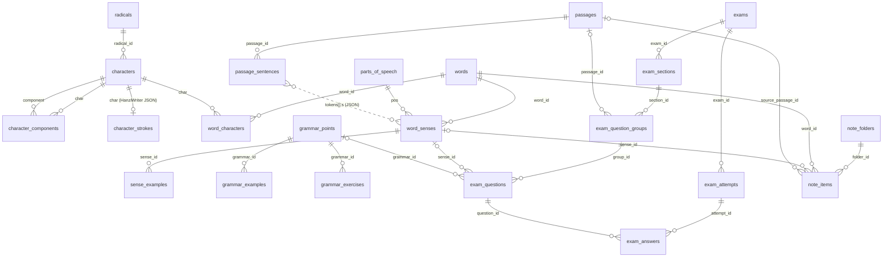

# Thiết kế lại DB — HSK Web (v4)

- Lý do của từng quyết định thiết kế: [DESIGN.md](DESIGN.md)
- DDL: [schema.sql](schema.sql) (23 bảng + FTS, đã chạy thử trên SQLite)
- DB cũ: `data/lessons.db`, 6 bảng: `lessons`, `kanji`, `mb_lessons`, `hanzii_grammar`, `note_folders`, `note_items`
- Mọi số liệu trong tài liệu này đo trực tiếp trên DB cũ ngày 2026-10-01

## 1. Sơ đồ quan hệ giữa các bảng

## 2. Bảng mới lấy dữ liệu từ đâu

Ký hiệu cột "Nguồn":
- ✅ có sẵn trong DB cũ.
- 🔧 có sẵn nhưng phải chuẩn hoá hoặc tính ra.
- ⚠️ **không có dữ liệu**, phải seed tay, dùng AI hoặc để trống.

### 2.1 Chữ Hán

**`radicals`** (~222 dòng) — cũ: `kanji.radical`, text dạng "nữ 女"

| Cột | Nguồn |
|---|---|
| `form`, `han_viet` | 🔧 tách `kanji.radical` "nữ 女" thành `han_viet='nữ'`, `form='女'` (222 giá trị khác nhau, 1 dòng rỗng) |
| `kangxi_no`, `meaning_vi`, `stroke_count` | ⚠️ seed từ danh sách 214 bộ Khang Hy |

**`characters`** (11.905 dòng + 19 dòng `pending` cho chữ chưa có) — cũ: `kanji`

| Cột | Nguồn |
|---|---|
| `char` | ✅ `kanji.char` |
| `radical_id` | 🔧 `kanji.radical` → tra `radicals.form` |
| `han_viet` | ✅ `kanji.cn_vi` ("nhĩ.nễ" giữ nguyên) |
| `pinyin` | ✅ `kanji.pinyin` ("xíng, háng, hàng, héng") |
| `stroke_count` | ✅ `kanji.strokes` |
| `formation`, `formation2` | 🔧 `kanji.lucthu`: 20 kiểu viết (có `&amp;`, thứ tự đảo) quy về 2 giá trị trong danh mục; 118 dòng rỗng |
| `structure` | ✅ `kanji.hinhthai` |
| `stroke_order` | ✅ `kanji.netbut` |
| `frequency` | 🔧 `kanji.popular` text 5 mức ("rất thấp" = 1 … "rất cao" = 5) |
| `hv_meanings` | ✅ `kanji.means_tdpt` |
| `hv_compounds` | ✅ `kanji.means_tg` |
| `hv_dictionary` | ✅ `kanji.means_tdtd` |
| `crawl_status`, `crawl_error`, `crawled_at` | 🔧 `kanji.crawled_at`. Hiện 0 dòng lỗi |
| *(dòng thêm)* | ⚠️ 21 thành phần Ý/Âm (亼, 丩, 咼…) và 7 chữ trong vocab chưa có trong `kanji`: thêm dòng `crawl_status='pending'` để crawl sau |

**`character_components`** (1.145 dòng, cho 642 chữ) — cũ: `kanji.botu_claude`

| Cột | Nguồn |
|---|---|
| `char`, `position` | ✅ `kanji.char` + thứ tự trong mảng `botu_claude` |
| `component` | ✅ `botu_claude[].ph` |
| `role` | 🔧 `botu_claude[].t`: `y` → `meaning`, `am` → `sound`, `solo` → `self` |
| `note` | ✅ `botu_claude[].n` |
| `source` | 🔧 `'ai'` |

Không lấy thêm từ 2 nguồn khác:
- `kanji.botu` (130 dòng) đã được copy sang `botu_claude`.
- `lessons.data.vocab[].botu`: đã đối chiếu, 643/643 chữ đều có trong `botu_claude`.

⚠️ **11.263 chữ chưa có phân tích Ý/Âm.**

**`character_strokes`** (8.009 dòng) — cũ: `kanji.strokes_svg`

Tên cột cũ gây hiểu nhầm: dữ liệu không phải SVG mà là JSON nét chữ cho HanziWriter, dạng `{strokes, medians, radStrokes}`.

| Cột | Nguồn |
|---|---|
| `char` | ✅ `kanji.char`, chỉ lấy các dòng có dữ liệu |
| `data` | ✅ `kanji.strokes_svg` (8.009 dòng hợp lệ) |
| `has_medians` | 🔧 có `$.medians` hay không (7.704 có; 305 dòng cũ là mảng đường nét trần, được chuyển thành `{"strokes": [...]}`) |
| `source` | 🔧 `'hanzii'` |

⚠️ 3.896 chữ có `strokes_svg = ''` (Hanzii không trả về). Những chữ này không có dòng trong bảng mới. UI vẫn để HanziWriter tự tải từ CDN `hanzi-writer-data`, giống hiện nay. Lưu ý: đây đều là chữ hiếm, thử 30 chữ thì CDN cũng không có chữ nào. Toàn bộ 2.883 chữ dùng trong vocab và bài khóa đều đã có dữ liệu nét trong DB.

### 2.2 Từ vựng

**`words`** (~8.900 dòng) — gộp từ 3 nguồn:
- `lessons.data.vocab[]`: 4.927 từ.
- Token trong `mb_lessons.content` có `wordId`: 6.816 từ.
- `note_items`: 5 từ.

Hai nguồn đầu trùng nhau 2.835 từ.

| Cột | Nguồn |
|---|---|
| `hanzi` | ✅ `vocab[].zh` / `content[][].hanzi` / `note_items.zh` |
| `pinyin` | 🔧 `vocab[].py` / `content[][].pinyin`, chuẩn hoá: bỏ khoảng trắng thừa, dạng từ điển (`jǔ xíng` → `jǔxíng`) |
| `pinyin_plain` | 🔧 tính từ `pinyin` (bỏ dấu) |
| `traditional` | ⚠️ không có. Chuyển đổi tự động bằng thư viện (OpenCC) |
| `han_viet` | 🔧 ghép `characters.han_viet` từng chữ. ⚠️ chữ có nhiều âm Hán Việt ("nhĩ.nễ") cần chọn tay |
| `hsk_level` | 🔧 cấp thấp nhất trong các bài "HSK1".."HSK6" (từ xuất hiện ở 2 cấp giữ cấp thấp hơn). **Không** lấy `content[][].hsk` của Mandarin Bean (thang HSK 3.0, có cấp 7); cấp đó nằm ở `word_senses.hsk_level` |
| `source` | 🔧 `import` / `mandarin_bean` / `manual` (từ ghi chú) |
| *(bỏ `mb_word_id`)* | Chuyển xuống `word_senses.mb_word_id`: 1 `wordId` là 1 mục từ điển; cùng (chữ, pinyin) có thể có nhiều `wordId` (钱 "tiền" / "họ Tiền") |
| `created_at` | ✅ `lessons.created_at` / `note_items.created_at` |

**`word_characters`** (~22k dòng) 🔧 tách `words.hanzi` thành từng chữ.

**`parts_of_speech`** (~15 dòng) ⚠️ seed tay: n, v, adj, adv, m, conj, pron, prep, num, part, propn, intj, vo, modal, phrase.

**`word_senses`** (~12.500 dòng trước khi gộp)

| Cột | Nguồn |
|---|---|
| `meaning_vi`, `pos` | ✅ `vocab[].vn`, 🔧 `vocab[].pos` map sang mã từ loại. Ô gộp như "Động từ / Danh từ" tách thành 2 nghĩa |
| `meaning_en` | ✅ `content[][].definition`: mỗi cặp (wordId, definition) khác nhau là 1 nghĩa (7.531 cặp; 会 có 3 nghĩa) |
| `pos` (nghĩa từ Mandarin Bean) | ⚠️ không có từ loại. Suy từ tiếng Anh bằng AI ("to …" → v) |
| `hsk_level` | 🔧 `content[][].hsk` / cấp của bài HSK |
| `source` | 🔧 `import` / `mandarin_bean` |

Các điểm ⚠️ của bảng này:
- **Nghĩa tiếng Việt (từ bài HSK) và nghĩa tiếng Anh (từ Mandarin Bean) của cùng một từ không tự ghép được với nhau.** Sau import sẽ là các nghĩa riêng. Cần một bước ghép có AI hỗ trợ, người duyệt lại (Phase 7).
- 69% vocab bị ghi "Danh từ" (3.516/5.067), nhiều chỗ sai (以为, 位于, 使). Cần soát lại.

**`sense_examples`**

| Cột | Nguồn |
|---|---|
| `zh`, `vi` | ✅ `vocab[].ex.zh`, `vocab[].ex.vn` (5.067 ví dụ) |
| `pinyin`, `en` | ⚠️ không có |
| *(cho từ Mandarin Bean)* | 🔧 có thể tự lấy câu bài khóa chứa token đó làm ví dụ (thiếu bản dịch) |

### 2.2b Bài học (`lessons`, `lesson_words`, `lesson_grammar`)

Chỉ 6 bài upload từ `.docx` là bài học. 6 sheet HSK1–HSK6 từ Excel chỉ là danh sách từ (`words.hsk_level`), không thành bài.

| Bảng / cột | Nguồn |
|---|---|
| `lessons.id` | ✅ `lessons.id` cũ (nanoid), nên link `/lesson/<id>` không đổi |
| `lessons.title`, `subtitle` | ✅ `lessons.title`, `data.subtitle` |
| `lessons.hsk_level`, `format` | ✅ `lessons.level` ("HSK2" → 2), `format = 'hsk2'` |
| `lessons.source` | 🔧 `'import'` |
| `lesson_words` | ✅ `data.vocab[]` theo thứ tự; `sense_id` = nghĩa được tạo/khớp từ dòng vocab đó (65 dòng) |
| `lesson_grammar` | ✅ `data.grammar[]` theo thứ tự → `grammar_points` vừa tạo ở P4 (10 dòng) |

### 2.3 Bài khóa

**`passages`** (729 dòng) — cũ: `mb_lessons`

| Cột | Nguồn |
|---|---|
| `slug`, `source_url` | ✅ `mb_lessons.slug`, `url` |
| `source` | 🔧 `'mandarin_bean'` |
| `title_zh`, `title_zh_trad`, `title_en` | ✅ `title_zh_simplified`, `title_zh_traditional`, `title_en` |
| `title_vi` | ⚠️ không có, dịch bằng AI |
| `hsk_level` | ✅ `hsk_level` |
| `category` | 🔧 `categories` bỏ "Checked"/"Uncheck". Có 1 bài mang 2 danh mục (Lifestyle, News) → chọn 1 |
| `review_status` | 🔧 `categories` có "Checked" → `checked`, ngược lại → `unchecked` |
| `audio_url` | ✅ `audio_url` (729/729 có) |
| `audio_source` | 🔧 `'crawl'` |
| `translation_status` | 🔧 `'none'` |
| `sentence_count`, `vocab_count` | 🔧 tính lại từ `passage_sentences` |
| `ai_model`, `ai_params` | NULL (chỉ dùng cho bài AI sinh sau này) |

**`passage_sentences`** (6.629 dòng)

| Cột | Nguồn |
|---|---|
| `idx` | ✅ index đoạn trong `content[]` (sau lần tách câu ngày 07/09, 1 đoạn = 1 câu) |
| `zh` | 🔧 ghép `content[idx][].hanzi` |
| `tokens` | 🔧 `content[idx][]` → `{h: hanzi, p: pinyin, s: word_senses.id}`. `s` tra theo (wordId, definition). Bỏ `definition` và `hsk` lặp lại |
| `audio_start`, `audio_end` | ✅ `sentence_timestamps[idx].start/end` (729/729 bài có) |
| `vi`, `en` | ⚠️ không có, dịch bằng AI |

### 2.4 Ngữ pháp

**`grammar_points`** (1.734 + 10 dòng)

| Cột | Từ `hanzii_grammar` | Từ `lessons.data.grammar[]` |
|---|---|---|
| `source_data` | `'hanzii'` | `'import'` |
| `external_uid` | ✅ `uid` | — |
| `title` | ✅ `keywords` hoặc `title` | ✅ `title` |
| `title_vi` | ✅ `title` | ✅ `titleVn` |
| `formula` | 🔧 `keywords` / dòng "Cấu trúc:" trong `contents` / `use_for` | ✅ `formula` |
| `explanation` | 🔧 `contents` bỏ các dòng ví dụ (parse **một lần**) | ✅ `explanation` |
| `use_for`, `keywords` | ✅ | — |
| `hsk_level` | 🔧 `hsk` "HSK1".."HSK6" → 1..6, "HSK7-9" → 7, "Khác" → NULL | 🔧 `lessons.level` |
| `cefr` | 🔧 `level` A1..C2 (`高等` → NULL) | — |
| `category` | 🔧 `level` = "Li hợp" / "Dịch" | — |
| `comparisons` | — | ✅ `comparisons[]` (4) |

**`grammar_examples`**
- Từ Hanzii: 🔧 parse `contents` thành `zh`, `vi`. `pinyin` lấy phần `/…/` (code cũ đang để nhầm pinyin vào `note`).
- Từ bài học: ✅ `examples[]` (38).

**`grammar_exercises`**: ✅ `lessons.data.grammar[].exercises[]` (27).

### 2.5 Ghi chú

| Bảng mới | Nguồn |
|---|---|
| `note_folders` | ✅ `note_folders` (2 dòng) |
| `note_items.word_id` | 🔧 tra `words` theo (`zh`, `py`). Không có thì tạo từ mới (`source='manual'`) kèm nghĩa từ `vn`/`pos` |
| `note_items.sense_id` | 🔧 nghĩa khớp `vn`, nếu không thì NULL |
| `note_items.source_passage_id` | ✅ `source_lesson_id`, hiện cả 5 dòng đều rỗng |

### 2.6 Bài kiểm tra

`exams` … `exam_answers`: ⚠️ tính năng mới, chưa có dữ liệu. Nguồn đề: `source_data` = `crawl` / `ai`, phân loại theo `hsk_level`.

## 3. Dữ liệu cũ sẽ bị bỏ, cần xác nhận

| Dữ liệu cũ | Lý do | Rủi ro |
|---|---|---|
| `kanji.raw` (39 MB), `hanzii_grammar.raw` | Các field cần dùng đã tách ra cột | Còn trong file backup |
| `kanji.botu` | Đã có trong `botu_claude` | Không |
| `lessons.data.vocab[].botu` | Trùng `botu_claude` (đã đối chiếu 643/643) | Không |
| `mb_lessons.content_text` | Tính lại được từ `passage_sentences.zh` | Không |
| `mb_lessons.vocab_count`, `sentence_count` | Tính lại | Không |
| `lessons.data.vocab[].id` (id ngẫu nhiên) | Không còn bảng `lessons` | ⚠️ Đang được dùng: `MatchGame` lấy làm `pairId`, link `?word=` từ ghi chú. Phase 7 thay bằng `words.id` / `word_senses.id` |
| `lessons.id` (nanoid) | Không còn bảng `lessons` | ⚠️ Link `/lesson/<id>` và key localStorage `match-hs-<id>` hỏng. Phase 7 thêm route mới + chuyển hướng |
| Cách nhóm ngữ pháp theo bài | **Đã chốt bỏ.** Ngữ pháp chỉ chia theo `hsk_level` | Không |
| `lessons.subtitle` ("149 từ vựng HSK1") | Tính lại được | Không |

## 4. Plan thực hiện

### Nguyên tắc an toàn
- **Không ghi vào `data/lessons.db`.** Script migration mở DB cũ ở chế độ chỉ đọc (`readonly`) và ghi sang file mới `data/hsk.db`.
- Mỗi phase là một script chạy lại được: xoá `hsk.db` rồi chạy lại từ Phase 1.
- App chỉ chuyển sang DB mới ở bước cutover (Phase 8). Trước đó app vẫn chạy trên `lessons.db`.
- Rollback: trỏ `DB_PATH` về `lessons.db`.

### Các phase

| Phase | Việc | Kiểm tra / điều kiện qua |
|---|---|---|
| **0. Chuẩn bị** | Commit các thay đổi đang dở. Backup `lessons.db` vào `data/backups/` kèm checksum. Tạo `scripts/migrate-v4/` (TypeScript, chạy bằng `tsx`). Tạo module hằng số dùng chung: bộ dấu câu (gồm `“ ” ‘ ’`), chuẩn hoá pinyin | Checksum bản backup khớp DB gốc |
| **1. Chữ Hán** | Seed `radicals` (222 dạng + số Khang Hy) → `characters` (+ 19 dòng `pending`) → `character_components` (`verified = 0`) → `character_strokes` (8.009 dòng) | `characters` = 11.906 + số dòng thêm; `components` = 1.146; `strokes` = 8.009; không lỗi FK |
| **2. Từ vựng** | Seed `parts_of_speech`. Tạo `words` theo thứ tự: bài HSK → bài chủ đề → wordId Mandarin Bean → ghi chú. Chuẩn hoá pinyin: bỏ khoảng trắng, đưa biến điệu của 一/不 về dạng từ điển. Sinh `word_characters`, `word_senses` (`pos` cũ nhập với `verified = 0`), `sense_examples`, `words_fts` | ~8.900 từ; 7.531 nghĩa en + ~5.000 nghĩa vi; 106 từ trùng giữa các cấp đã gộp; mọi chữ trong `words` có trong `characters` |
| **3. Bài khóa** | `passages`, `passage_sentences`. Token dấu câu (theo bộ dấu câu chung) không có `s`. `review_status` lấy từ `categories` | 729 bài; 6.629 câu; tổng token = 119.864; số mốc audio khớp số câu; in danh sách 3 bài lệch trạng thái (`shopping-story`, `distribute-watermelon`, `climb-mountain`) để duyệt |
| **4. Ngữ pháp** | `grammar_points` (`source_data` = `hanzii` / `import`). Parse `contents` một lần, giữ nguyên văn giải thích. `grammar_examples`, `grammar_exercises` | 1.744 điểm; 437 điểm `hsk_level = NULL`; 27 bài tập; 38 ví dụ từ bài upload |
| **5. Ghi chú** | `note_folders`, `note_items` (tra `word_id`, `sense_id`) | 2 folder, 5 item, không item mồ côi |
| **6. Đối chiếu tổng** | Một script in báo cáo số liệu DB cũ ↔ DB mới cho mọi phase, cộng các mẫu ngẫu nhiên để xem tay | **Bạn duyệt báo cáo** rồi mới sang Phase 7 |
| **7. Chuyển code** | Theo [data-layer.md §7](../data-layer.md): tạo `src/server/{db,repos,services}`, `src/types/api.ts`. Chuyển route theo thứ tự notes → grammar → reading → dictation → kanji → vocab/search → upload. Route mới thay `/lesson/[id]`. Chuyển script sang `.ts`; `align-whisper.py` ghi qua API | Từng trang chạy đúng trên `hsk.db` ở môi trường dev; `npm run build` không lỗi |
| **8. Cutover** | Ngừng sửa dữ liệu (căn audio, ghi chú). Backup lại `lessons.db`. Chạy lại Phase 1–6 trên bản mới nhất. Đổi `DB_PATH` sang `hsk.db`. Xoá `src/lib/db.ts` và code thừa | Smoke test toàn bộ trang. Giữ `lessons.db` để rollback |
| **9. Bù dữ liệu thiếu (AI)** | Ghép nghĩa vi↔en; soát từ loại; dịch câu bài khóa và `title_vi`; phân tích Ý/Âm cho chữ còn thiếu; `traditional`; nét cho 305 chữ thiếu `medians` | Người duyệt, ghi nhận qua `verified` / `translation_status` |
| **10. Bài kiểm tra** | Crawl đề + AI sinh đề, làm bài, chấm điểm | — |

### Ngoài phạm vi migration
- **Lỗi chép chính tả bị lệch khi gõ thiếu chữ** (`matchDictationWords`): bạn tự sửa.
- **Các lỗi giao diện** trong [features/README.md](../features/README.md): sửa riêng. Lỗi nào nằm trong file bị viết lại ở Phase 7 (ví dụ "Phổ biến" luôn "Thấp", panel chữ bỏ qua dữ liệu nét trong DB) thì sửa luôn khi viết lại.

## 5. Quyết định đã chốt

Xem [DESIGN.md mục 8](DESIGN.md). Kế hoạch triển khai chi tiết theo từng task: [../migration-plan.md](../migration-plan.md).
