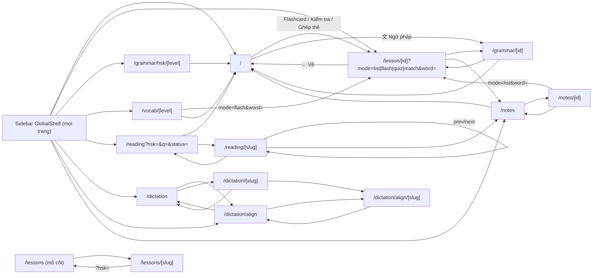

# Điều hướng: trang chủ, sidebar, sơ đồ route

## Mục đích

Mô tả khung chung của app (layout + sidebar `GlobalShell`), trang chủ `/`, component `Pagination`, và toàn bộ route/màn hình: mỗi trang lấy dữ liệu ở đâu, đi từ đâu tới đâu.

## Màn hình & route

### Khung chung
- `src/app/layout.tsx:11-30`: `<html lang="vi">`, nạp Google Fonts (Noto Serif SC, Be Vietnam Pro, JetBrains Mono), icon `/icon.png`, metadata title "ice-bear is learning". Body = `<GlobalShell />` + `
{children}
`.
- `GlobalShell` (`src/app/components/GlobalShell.tsx`) là client component render ở **mọi** trang: sidebar cố định bên trái + "mini rail" 52 px khi sidebar đóng.
- Không có `middleware`/`proxy`, không có route group, không có `not-found` chung (chỉ có `src/app/lessons/[slug]/not-found.tsx`). Thư mục `src/components/` rỗng.

### Danh sách route trang

| Route | File | Loại | Dữ liệu | Thuộc tính năng |
|---|---|---|---|---|
| `/` | `src/app/page.tsx` | client | `GET /api/lessons`, `POST /api/upload`, `DELETE /api/lessons/[id]` | Trang chủ / upload ([lesson-upload.md](lesson-upload.md)) |
| `/lesson/[id]` | `src/app/lesson/[id]/page.tsx` | client | `GET /api/lessons/[id]`, `/api/kanji/[char]`, notes API | [lesson-study.md](lesson-study.md), [kanji.md](kanji.md) |
| `/grammar/[id]` | `src/app/grammar/[id]/page.tsx` | client | `GET /api/lessons/[id]` (`grammar[]` của bài) | Ngữ pháp theo bài |
| `/grammar/hsk/[level]` | `src/app/grammar/hsk/[level]/page.tsx` | client | `GET /api/grammar?level=` (bảng `hanzii_grammar`) | Ngữ pháp Hanzii |
| `/vocab/[level]` | `src/app/vocab/[level]/page.tsx` | client | `GET /api/vocab?level=` (gộp vocab mọi bài có `level`) | Từ vựng theo cấp |
| `/reading` | `src/app/reading/page.tsx` | server | `@/lib/db` (`mb_lessons`) | Bài đọc |
| `/reading/[slug]` | `src/app/reading/[slug]/page.tsx` + `LessonReader.tsx` | server + client | `@/lib/db`; `GET /api/search` khi tra từ | Bài đọc |
| `/dictation` | `src/app/dictation/page.tsx` | client | `GET /api/dictation/lessons` | Chép chính tả |
| `/dictation/[slug]` | `src/app/dictation/[slug]/page.tsx` | client | `GET /api/dictation/lessons/[slug]`, `POST /api/dictation/check` | Chép chính tả |
| `/dictation/align` | `src/app/dictation/align/page.tsx` | client | `GET /api/dictation/align` | Căn audio |
| `/dictation/align/[slug]` | `src/app/dictation/align/[slug]/page.tsx` | client | `GET/POST /api/dictation/align/[slug]` | Căn audio |
| `/notes` | `src/app/notes/page.tsx` | client | notes folders API | Ghi chú |
| `/notes/[id]` | `src/app/notes/[id]/page.tsx` | client | notes folders/items API | Ghi chú |
| `/lessons` | `src/app/lessons/page.tsx` | server | **file** `data/mandarin-bean-lessons.json` qua `src/lib/lessons.ts` | Bài đọc MB bản cũ — **không có link nào trỏ tới** |
| `/lessons/[slug]` | `src/app/lessons/[slug]/page.tsx` | server, `generateStaticParams` | như trên | như trên |

(Các trang ngoài phạm vi 4 tài liệu này chỉ được liệt kê theo link/fetch đã grep; chi tiết bên trong chưa xác minh.)

### Sơ đồ đi lại

Nguồn các cạnh: `src/app/page.tsx:13-17, 243`; `lesson/[id]/page.tsx:410, 433, 440`; `grammar/[id]/page.tsx:159, 178`; `grammar/hsk/[level]/page.tsx:110`; `vocab/[level]/page.tsx:59, 98`; `reading/page.tsx:52, 82`; `reading/[slug]/LessonReader.tsx:235, 249, 253, 256, 349, 361`; `reading/[slug]/page.tsx:24`; `dictation/page.tsx:119, 197`; `dictation/[slug]/page.tsx:359, 384, 401`; `dictation/align/page.tsx:90, 193`; `dictation/align/[slug]/page.tsx:416, 430`; `notes/page.tsx:29, 37, 77`; `notes/[id]/page.tsx:83, 176, 297`; `lessons/page.tsx:67, 79, 96`; `lessons/[slug]/page.tsx:62`; `lessons/[slug]/not-found.tsx:9`.

## Luồng xử lý

### Trang chủ `/` (`src/app/page.tsx`)
1. Mount → `GET /api/lessons` → `lessons` (meta: id, title, subtitle, level, createdAt, `vocabCount`, `grammarCount`; sắp `created_at DESC`, `db.ts:33-43`).
2. Header: logo, chip "N bài học", "M từ vựng" (tổng `vocabCount`), nút "+ Import bài học".
3. Lưới thẻ bài (`LessonCard`, `page.tsx:165-266`): sọc màu theo `level` (`LEVEL_COLOR`, chỉ HSK1–6; khác → xám), ngày tạo `vi-VN`, tiêu đề, subtitle, số từ / ngữ pháp, 3 nút chế độ (Flashcard `/lesson/id`, Kiểm tra `?mode=quiz`, Ghép thẻ `?mode=match`), nút "文 Ngữ pháp" `/grammar/id`, nút × xoá (`confirm` → `DELETE /api/lessons/[id]` → tải lại danh sách).
4. Rỗng → màn hình "Chưa có bài học nào" + nút upload.
5. Upload: xem [lesson-upload.md](lesson-upload.md).

### Sidebar `GlobalShell`
1. Mount (`GlobalShell.tsx:80-89`) gọi song song, **một lần**:
   - `GET /api/lessons` → `lessons` (nhóm theo `level` ∈ HSK1…HSK6, `:119-122`).
   - `GET /api/reading/counts` → `{total, byHsk}` (`getMBLessonCounts`, `db.ts:445-458`).
   - `GET /api/grammar` (không `level`) → `{counts: [{hsk, count}]}` từ `hanzii_grammar` (`db.ts:791-797`).
2. Đặt `padding-left` của `#app-main` và biến CSS `--sidebar-w` trên `body` = độ rộng sidebar (mở) hoặc 52 px (đóng) (`:91-95`). Header cố định của `/lesson/[id]` dùng `left: var(--sidebar-w, 272px)` (`lesson/[id]/page.tsx:406`).
3. Mục đang active theo `pathname` (`activeSection`, `:51-58`): `/reading*` → reading, `/grammar*` → grammar, `/vocab*` và `/lesson*` → vocab, `/dictation*` → listen. Mục active tự mở rộng (`:97-101`).
4. Các mục (`SECTIONS`, `:25-32`) và nội dung khi mở:
   - **Từ vựng** (`vocab`): mỗi cấp HSK1–6 có bài → nhóm con thu gọn được, hiện tổng số từ; mở ra: "Tất cả từ vựng →" `/vocab/HSKn` + từng bài → `/lesson/id?mode=list`.
   - **Ngữ pháp** (`grammar`): mỗi cấp trong `HSK1…HSK6, HSK7-9, Khác` có số điểm > 0 → `/grammar/hsk/<level>` (chỉ ngữ pháp Hanzii, không có link tới `/grammar/[id]` của bài).
   - **Đọc bài khoá** (`reading`): "Tất cả N bài →" `/reading`; HSK1–5 có bài → `/reading?hsk=n` (`prefetch={false}`).
   - **Luyện nghe** (`listen`): `/dictation`, `/dictation/align`; bấm hai link này **đóng sidebar** (`setOpen(false)`, `:319, 325`).
   - **Kiểm tra** (`quiz`), **Trò chơi** (`game`): cùng cây HSK như Từ vựng, mỗi bài → `/lesson/id?mode=quiz` / `?mode=match` (`lessonHref`, `:34-40`), hiện số bài.
   - Link "📝 Ghi chú của tôi" `/notes`; footer "⌂ Trang chủ" `/`.
5. Ô tìm kiếm (`:209-257`): debounce 300 ms, bỏ qua khi đang gõ IME (`composingRef`) → `GET /api/search?q=` → `searchVocab` (`db.ts:825-847`): duyệt JSON mọi bài, khớp `zh` chứa q, hoặc pinyin bỏ dấu chứa q bỏ dấu, hoặc `vn` chứa q (không phân biệt hoa thường), tối đa 40 kết quả. Bấm kết quả → `/lesson/<lessonId>` và xoá ô tìm.
6. Kéo mép phải để đổi độ rộng 200–400 px (`:429-453`).
7. Mini rail (khi `open=false`, `:135-173`): logo/nút › mở lại sidebar, icon các mục (bấm = mở sidebar), icon 📝 → `/notes`.

### `Pagination` (`src/app/components/Pagination.tsx`)
- Props: `currentPage`, `totalPages`, `onPageChange`, `accent`, `total`, `pageSize`. `totalPages ≤ 1` → không render.
- Hiện trang 1, trang cuối và các trang cách trang hiện tại ≤ 2; khoảng trống chèn "…" (`:15-21`). Nút "← Trước" / "Sau →" disable ở biên.
- Dòng "Trang x/y · N mục" chỉ hiện khi truyền cả `total` và `pageSize` (`pageSize` không dùng vào việc khác).
- Dùng ở: `/lesson/[id]` (list), `/vocab/[level]`, `/grammar/hsk/[level]`, `/notes/[id]`. Phân trang hoàn toàn phía client; component không đọc/ghi URL.

## API

API mà trang chủ và sidebar gọi:

| Method | Path | Input | Output | File |
|---|---|---|---|---|
| GET | `/api/lessons` | — | `{lessons: LessonMeta[]}` | `src/app/api/lessons/route.ts`, `db.ts:33-43` |
| DELETE | `/api/lessons/[id]` | `id` | `{ok:true}` | `src/app/api/lessons/[id]/route.ts:13-17` |
| POST | `/api/upload` | form `file` | `{lesson}` / `{lessons}` | xem [lesson-upload.md](lesson-upload.md) |
| GET | `/api/reading/counts` | — | `{total, byHsk: {1: n, …}}` | `src/app/api/reading/counts/route.ts`, `db.ts:445-458` |
| GET | `/api/grammar` | không `level` | `{counts: [{hsk, count}]}` | `src/app/api/grammar/route.ts:6-11`, `db.ts:791-797` |
| GET | `/api/search` | `q` | `{results: [{lessonId, lessonTitle, level, zh, py, vn, pos}]}` (≤ 40) | `src/app/api/search/route.ts`, `db.ts:825-847` |

Route API không được trang nào gọi (đã grep `src/`, `scripts/`): `GET /api/reading`, `GET /api/reading/[slug]` (trang reading đọc DB trực tiếp phía server).

## Dữ liệu

| Dùng ở | DB cũ | DB mới v4 |
|---|---|---|
| Thẻ bài trang chủ, cây bài ở sidebar | `lessons(id, title, subtitle, level, created_at)` + đếm `data.vocab/grammar` | Không còn `lessons`: dựng danh sách "bài" ảo từ `words.hsk_level` (đếm theo cấp) và `words.topic`; `grammarCount` từ `grammar_points` |
| Số bài đọc theo cấp | `mb_lessons` `GROUP BY hsk_level` | `passages` `GROUP BY hsk_level` |
| Số điểm ngữ pháp theo cấp | `hanzii_grammar` `GROUP BY hsk` (text "HSK1"…"HSK7-9", "Khác") | `grammar_points` `GROUP BY hsk_level` (số 1–7, NULL = "Khác"); có thể lọc `source='hanzii'` |
| Tìm từ ở sidebar | parse JSON `lessons.data` mọi bài | `words_fts` (trigram: hanzi, pinyin_plain, han_viet, meanings) |

## Logic chi tiết

- Màu cấp: trang chủ dùng bảng màu riêng (`page.tsx:8-11`), sidebar dùng bảng khác (`GlobalShell.tsx:16-20`) — cùng HSK1 nhưng khác màu.
- Sidebar nhóm bài **chỉ theo `level` chính xác `HSK1`…`HSK6`**; bài có `level` khác (vd. fallback `'HSK'` của upload docx, `claude.ts:130`) không hiện ở sidebar, chỉ hiện ở trang chủ.
- Sidebar mặc định mở rộng `vocab`, `grammar`, nhóm con `grammar-HSK2` (khoá không khớp mục grammar vì grammar không có nhóm con) (`:71-72`).
- Trang `/reading` lọc theo `?hsk=&q=&status=` qua `ReadingFilters` (`router.replace`), ngoài phạm vi tài liệu này.

## Trạng thái phía client

| State | Nơi | Ghi chú |
|---|---|---|
| `open`, `sidebarW` | `GlobalShell.tsx:63-64` | Không lưu localStorage → reload về mở, 272 px |
| `lessons`, `mbCounts`, `grammarCounts` | `:68-70` | Tải 1 lần khi mount, không làm mới |
| `expanded`, `subExpanded` | `:71-72` | Mở/đóng mục và nhóm con, không lưu |
| `query`, `searchResults`, `searching`, refs debounce/IME | `:73-78` | |
| Style DOM: `#app-main.style.paddingLeft`, `body --sidebar-w` | `:91-95` | Ghi trực tiếp vào DOM |
| Trang chủ: `lessons`, `uploading`, `progress`, `error` | `page.tsx:20-23` | |

Toàn app không dùng localStorage ngoài kỷ lục ghép thẻ (`match-hs-<id>`, xem [lesson-study.md](lesson-study.md)) — chỉ xét các file trong phạm vi tài liệu này; các trang reading/dictation chưa xác minh.

## Script liên quan

Không có.

## Vấn đề phát hiện

1. **Nút "Thu gọn" (‹) không thu gọn sidebar**: `onClick={closeAll}` (`GlobalShell.tsx:194-195`) chỉ xoá ô tìm kiếm, không `setOpen(false)`. Cách duy nhất đóng sidebar là bấm link Luyện nghe (`:319, 325`).
2. **Sidebar không làm mới**: danh sách bài chỉ tải khi mount (`:80-89`) → upload/xoá ở trang chủ không phản ánh lên sidebar tới khi reload.
3. **Kết quả tìm kiếm không mở đúng từ**: link `/lesson/<id>` không kèm `?word=` (`:239`) → luôn mở thẻ đầu tiên. Trang `/lesson/[id]` đã hỗ trợ `?word=`.
4. **`activeSection` nhận nhầm `/lessons`** là mục Từ vựng vì `'/lessons'.startsWith('/lesson')` (`:55`). Mục `quiz`/`game` không bao giờ active (`/lesson?mode=quiz` → vocab).
5. **Route `/lessons`, `/lessons/[slug]` mồ côi**: không có link tới; đọc `data/mandarin-bean-lessons.json` thay vì DB `mb_lessons` mà `/reading` dùng → 2 nguồn dữ liệu bài đọc song song. Bộ lọc chỉ HSK 1–5 (`src/types/lesson.ts:31`).
6. Route API không ai gọi: `GET /api/reading`, `GET /api/reading/[slug]`.
7. `subExpanded` mặc định `'grammar-HSK2'` không dùng tới (mục grammar không có nhóm con) (`:72`).
8. Thư mục `src/components/` rỗng; component dùng chung nằm ở `src/app/components/`.
9. Sidebar `HSK_LEVELS` cố định HSK1–6 cho từ vựng, `[1..5]` cho bài đọc (`:302`): bài đọc cấp khác 1–5 (nếu có) không hiện ở sidebar.

## Ảnh hưởng khi chuyển DB v4

1. `GET /api/lessons` (trang chủ + sidebar) phải trả "bài" ảo (theo cấp HSK / chủ đề) thay cho dòng `lessons`; `id` bài đổi dạng (vd. `hsk-1`, `topic-giao-thong`) → mọi link `/lesson/<id>`, `/grammar/<id>` đổi theo.
2. Nút xoá bài và nút upload ở trang chủ cần thiết kế lại (không còn bản ghi bài để xoá).
3. `/api/search` chuyển sang `words_fts`; kết quả không còn `lessonId`/`lessonTitle` → link nên trỏ tới trang từ hoặc `/lesson/hsk-<level>?word=`.
4. `/api/reading/counts` → `passages`; `/api/grammar` counts → `grammar_points.hsk_level` số, sidebar đang dùng nhãn text "HSK7-9"/"Khác" làm khoá và URL `/grammar/hsk/<level>` → cần map lại.
5. Nếu bỏ hẳn `/lessons` (bản cũ đọc JSON), xoá luôn `src/lib/lessons.ts`, `src/types/lesson.ts`, `src/app/lessons/**`.
